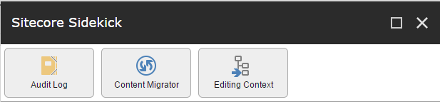
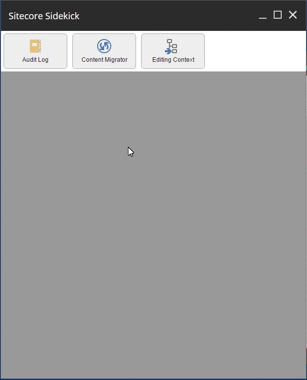
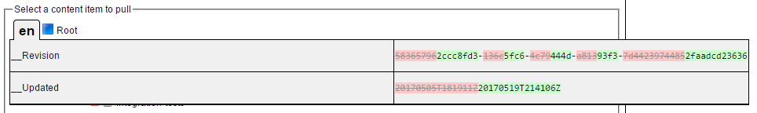
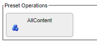
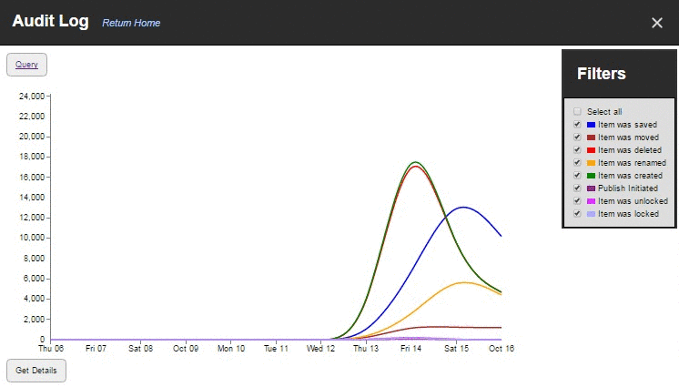
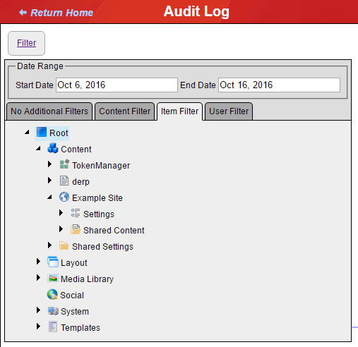
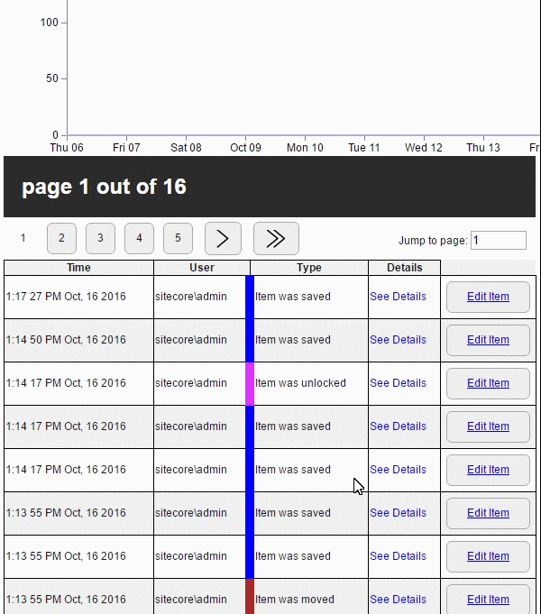
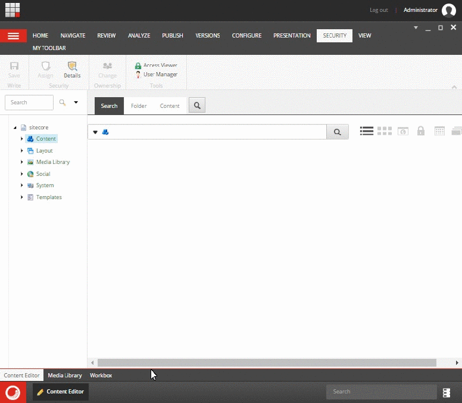

# Sitecore Sidekick


A modular toolkit for Sitecore that is an administrator or author's handy little sidekick.

Like videos? Check out the [Sitecore Sidekick presentation](https://www.youtube.com/watch?v=x9foAgxGQDc) at the Portland Sitecore User's Group, which goes over the main Sidekick features and how to use them. NOTE: the version in the presentation is slightly out of date, but it is still accurate.

## Installing Sidekick

Sitecore Sidekick is distributed via NuGet packages. Sidekick uses self-installing technology for its Sitecore items, so no package installs are required - necessary items are created on first startup.

There are two main packages to choose from:

* `Sitecore Sidekick Complete` installs the Sidekick framework and all standard modules. It's the easiest way to get started.
* `Sitecore Sidekick Foundation` installs the core Sidekick framework. Install this if you wish to pick and choose which modules you want (modules are their own separate NuGet packages).

Installation is as simple as installing the NuGet packages you want from within Visual Studio.

### Via Package

Installing via Sitecore Package is not recommended, but find in the root of the repo the latest package.  If you use Unicorn in your project to serialize items make sure you install the (No Rainbow) package as this will not overwrite Unicorn's Rainbow dll files but rather utilize whatever version Unicorn is using (Sidekick can work with any version).  After installing some manual configuration is required in the App_Config/local/Sidekick folder with the zSCSContentMigrator.Local.config.example file.  Remove the .example and set up your list of remote content source URLs.

## Extending Sidekick

Implementing a new Sidekick app is easy by following [this](https://github.com/JeffDarchuk/SitecoreSidekick/blob/master/doc/SidekickTemplate.md) tutorial.

## Scripting Sidekick

Visit [here](https://github.com/JeffDarchuk/SitecoreSidekick/tree/master/Scripting) to see the powershell module.  Right now content migration operations are supported, more to come!

Make sure your shared secret matches what's on both the local and remote servers.  Like always with microchap the shared secret is never transfered over the wire in any way.

Use these tools to automate the content syncronization based on your build process with all the configuration options for pulling content that you would use in content migrator.

```powershell
Import-Module -Name SitecoreSidekick -Force -Verbose
$params = @{
    LocalUrl = "http://demo2"
    RemoteUrl = "http://demo"
    SharedSecret = "3a4e9aad-5d61-42ae-b262-de0e13f3b576"
    EventDisabler = $true
    BulkUpdate = $true
    PullParent = $true
}
#MAKE THE CONTENT FROM ONE SERVER MATCH THE OTHER EXACTLY
Copy-SKContent @params -RootId '{0DE95AE4-41AB-4D01-9EB0-67441B7C2450}' -Children -Overwrite -RemoveLocalNotInRemote
#MOVE ALL CONTENT FROM ONE SERVER TO THE OTHER AND ALLOWING UNIQUE ITEMS AT THE CONSUMER
Copy-SKContent @params -RootId '{0DE95AE4-41AB-4D01-9EB0-67441B7C2450}' -Children -Overwrite
#MOVE ONLY NEW CONTENT FROM ONE SERVER TO THE OTHER WITHOUT UPDATING MODIFIED
Copy-SKContent @params -RootId '{0DE95AE4-41AB-4D01-9EB0-67441B7C2450}' -Children
#ONLY MOVE THE INDIVIDUAL ITEMS AND NOT CHILDREN
Copy-SKContent @params -RootId '{0DE95AE4-41AB-4D01-9EB0-67441B7C2450}' -Overwrite

```

## Using Sidekick

It's very easy to use Sidekick. To open the Sidekick panel, you may choose between either:

* Opening the Sidekick application from the Sitecore Desktop's menu (on the right side), or
* Pressing `Shift-Alt-S` - in Desktop, Content Editor, or even Experience Editor

(Seriously, `Shift-Alt-S` is the way to go.)

The main panel looks like this:



Once the Sidekick panel is open, choose a tool to use. Here are the standard tool modules that are available with Sidekick:

## Content Migrator

Ever wished you could easily move production content and media back down into pre-production (e.g. dev) environments without resorting to shipping databases or slow package installs? Well Content Migrator is for you.

Content Migrator uses a secure REST service to transfer content from a remote Sitecore environment into a local Sitecore environment. Developers or authors simply open Sidekick, choose the content item(s) they want to pull down and from which remote Sitecore server, and click a button.



Content Migrator is also useful as a diff tool between Sitecore servers even if not pulling content. It has UI elements that indicate not only whether an item has changes, but also where an item's children have changes.


You can also display the exact details of the items' differences in a handy overlay diff view by clicking the red square next to the item:



### Content Migrator Architecture

Under the hood Content Migrator uses the [Rainbow](https://github.com/kamsar/Rainbow) serialization format to transfer content items. Rainbow is the format used by [Unicorn](https://github.com/kamsar/Unicorn), a serialization tool for developer items. Content Migrator extends the idea of Unicorn to content migration; if you're familiar with Unicorn, Content Migrator is essentially and ad-hoc Unicorn sync from a remote server. (Unicorn is not a dependency.)

Content Migrator is architected for speed, using async and multithreading technologies to provide quick syncing of large content trees. When the pull operation starts it spins up two separate thread pools, one for transmission of serialized item data from the remote server and another to ingest that data into Sitecore. Since the inhibiting factor here is the rate in which Sitecore can write item data to the database you can virtually eliminate the penalty of pulling items over the network in most cases (unless over a slow connection). How fast is Content Migrator? In a test between Content Migrator and installing a Sitecore Package for 24,000 items, where both databases contained most of the items already, Content Migrator was **102x** faster than a package installation due to it only writing necessary changes. (41 sec vs 70 min)

Content Migrator uses a secure protocol to authenticate remote requests. It uses a shared secret on both ends of the connection that uses [HMAC-SHA512](https://en.wikipedia.org/wiki/Hash-based_message_authentication_code) to both avoid ever transmitting the secret directly, and also to sign the message parameters and contents. There are also protections against [replay attacks](https://en.wikipedia.org/wiki/Replay_attack). NOTE: Even with these protections, requests should always be made via a trusted SSL connection if at all possible.

### Installing and Configuring Content Migrator

Installing Content Migrator is as simple as installing its NuGet package, [SitecoreSidekickContentMigrator](https://www.nuget.org/packages/SitecoreSidekickContentMigrator). 

After installation, you must configure it before using. The package installs `App_Config\Include\Sidekick\zSCSContentMigrator.Local.config.example`. Make a copy of this file, and remove the `.example` from the end. Configure the following settings:

* `authenticationSecret` - This is a shared secret that is used to authenticate to remote servers you want to pull content from. It must be at least 32 characters long (use a random string generator), and must be identical locally and remotely.
* `roots` - This defines which Sitecore paths Content Migrator is allowed to copy. Do not use Content Migrator as a deployment tool for developer items such as templates or renderings; it's for content. Use [Unicorn](https://github.com/kamsar/Unicorn) for that instead.
* `servers` - This defines which remote servers Content Migrator is allowed to pull from. Remote servers must have the Content Migrator NuGet package installed as well, and an identical `authenticationSecret`.
* `presets` - This defines predetermined operations to provide a single button push content migration strategy for common migration needs.

Next you will need to deploy Content Migrator to the remote server you wish to pull from. The simplest way to do this is to deploy the installed NuGet package to it, but it is also possible to deploy only the Sidekick assemblies and config patches.

Now you're ready to migrate some content!

### Content Migrator Presets

Using the preset xml node in the example configurations you can configure a predetermined operation configuration.  A common usecase for this is if you wanted an SXA site and it's media you can set it up as a preset to enable pulling content from that site as easy as a button click.  During the configuration you can specially design a list of whitelist servers that you want to only allow this operation to run targetting and/or a list of blacklisted servers or servers you don't want to allow this operation to run as.  In addition you can customize any of the common sync options for this preset to give full control of how the sync is performed.  Additionally any number of source items can be added by their IDs.

### Content Migrator Authorization

Out of the box, only Sitecore Administrators are allowed to access Content Migrator. It is possible to allow certain roles or users access, for example to allow authors to pull their own content changes down to a dev environment. See `zSCSContentMigrator.config` for the available options.

### Scripting Content Migrator

Content Migrator can be set to run as a scheduled agent. A sample commented out configuration for this can be found in `zSCSContentMigrator.config`. NOTE: this can be a bad idea, as depending on the sync settings it may result in automated overwriting of legitimate test content in preproduction environments. Make sure authors understand the implications of any scheduled content pull processes.

## Audit Log

The Audit Log module tracks and reports on content authors' actions. It allows you to answer questions like "who edited the most content last week." It is also possible to trace custom actions via code that calls the Audit Log API. The Audit Log interface consists of graphs and detailed tables that let you crunch the data your way.



The audit log has many kinds of filters that may be applied:



### Audit Log Details

Once you have the results filtering as you want them to, if you click the Get Details button it reports a list sorted chronologically.  You will also notice an edit item button, clicking this will open a lightbox modal for the content editor for the item related to the particular event. 

Each event is color coded as defined in the filter for a quick visual sweep of activity types.  You can additionally see more details on a particular event by clicking on "see details."  This is particularly useful for the save events as it displays an HTML diff of your change.



### Configuring the Audit Log

Backups and record duration can be configured in the `zSCSAuditLog.config` file.  It is recommended that you keep only what would be useful as due to the volume of data collected, these logs can get get large on a site with a high number of events if keeping logs for more than a week.

Additional events can be tracked using additional onSaved nodes.  Note that new registered events need to have a unique id assigned to it and while it’s not required a unique color would be preferable from a user experience standpoint.

### Adding Custom Audit Events

If you’d like to track something that’s not a sitecore event, such as a pipeline processor.  You can invoke a logger singleton to perform the tracking of the event.

```csharp
AuditLogger.Current.Log(MyEventRelatedSitecoreItem, "5", $"{HtmlForDetailedInformation");
```

Parameters:

* Sitecore Item related to the event
* string Id for the registered event in the configuration file
* Optional markup for the "see details" link to expose

## Editing Context

Ever wish you didn't have to switch databases to do things like add custom experience buttons or change the ribbon? With the Editing Context module, you don't have to.



The Editing Context module remembers what items you've been editing, gives shortcuts to common editor locations which you can configure, and has shortcuts to common developer location in the core and master databases.

Anytime an item is visited in the edit context, it opens it up in a modal over the top of the app. This makes it so you never have to switch databases and lose your context in Sitecore.

The developer functions are for Sitecore administrators only. The editor locations and item history are available to all authors. User security is further configurable through the `zSCSEditingContext.config` file.

## Deploying Sidekick

There are considerations to be made when deploying Sidekick to a production environment.

* For _Content Editing_ (CE or CM depending on who you ask), if using the Content Migrator module it may be appropriate to alter the allowed remote servers list. For example, production should not be allowed to pull from dev or QA.
* For _Content Delivery_ (CD) environments, all Sidekick configuration files (`App_Config\Include\Sidekick\*`) and assemblies (`Scs*.dll`) should be removed, as Sidekick has no function on a CD server.
